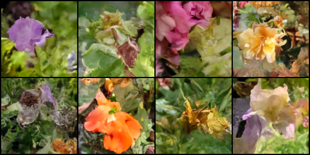

# Stable-Diffusion

This repository contains an implementation of the Stable Diffusion model for image generation.
It is trained on the Flowers102 dataset. Everything is implemented from scratch using PyTorch.

---

## Results


Here are some samples generated by the model after training for 500 epochs.
It can be seen that the model is able to generate realistic looking flowers (and some that look like organic waste).

---

## Installation

To get started with this project, follow these steps:

1. **Clone this repository**:

   ```bash
   git clone https://github.com/ProfessorNova/Stable-Diffusion.git
   cd Stable-Diffusion
   ```

2. **Set up Python Environment**:
   Make sure you have Python installed (tested with Python 3.10.11).

3. **Install PyTorch**:
   Visit the [PyTorch website](https://pytorch.org/get-started/locally/) for proper PyTorch installation based on your system configuration.

4. **Install Additional Dependencies**:
   There are two additional dependencies required for this project. `tqdm` is used for progress bars and `matplotlib` is used for plotting the results during inference.

   ```bash
   pip install tqdm matplotlib
   ```

5. **Run the Pretrained Model**:
   To generate images using the pretrained model, run the following command:

   ```bash
   python sd_inference.py
   ```

   This will generate eight images and plot them using matplotlib.

---

## Understanding Stable Diffusion

For getting a better understanding of how Stable Diffusion works and how it is implemented in this repository, I created a jupyter notebook (`notebook.ipynb`) which explains the fundamentals of Stable Diffusion together with the code. It also shows a creative way to generate images using a hand-drawn sketch of a flower.


---

## Model Architecture

Have a look at the `unet.py` file in the `lib` folder of this repository if you want to see the details of the model.

1. Noise Embedding

   - We first map the scalar noise level (a single float) into a high-dimensional embedding `(1×1×64)`.
   - This embedding will be broadcast, upsampled, and fused with feature maps in the decoder, so the network “knows” how much noise to remove at each spatial location.

2. Encoder (DownBlocks)

   - The noisy image `(128×128×3)` is first processed by a `Conv2D` layer to lift it into a `(128×128×64)` feature map.
   - We then apply a series of DownBlocks, each of which:
     - Halves the spatial resolution (e.g. `128→64`, `64→32`, …)
     - Increases the number of channels (e.g. `64→128→256→512→1024`)
     - Uses residual connections internally to ease gradient flow and preserve information.
   - At each stage we save the output feature map for later skip connections.

3. Bottleneck (ResidualBlock ×2)

   - Once we reach the smallest spatial size (`8×8`), we apply two ResidualBlock at constant channel width (`1024`).
   - These deepen the network’s representation power without further downsampling.

4. Decoder (UpBlocks)

   - We then reverse the process with a series of UpBlocks:
     - Upsample spatially (e.g. `8→16`, `16→32`, …)
     - Reduce channel width symmetrically to the encoder (e.g. `1024→512→256→128→64`)
     - Concatenate with the corresponding encoder feature map (the skip connection) at the same resolution
     - Fuse via convolution and residual connections
   - This combination of coarse, high-level features with fine, low-level details allows precise reconstruction of the denoised image.

5. Final Convolution
   - After the last UpBlock (back to `(128×128×64)`), a simple `Conv2D` layer reduces the channels to `3`, yielding a predicted noise map `(128×128×3)`.

Visualization:


---

## Training

To train the model from scratch, run the following command:

```bash
python sd_train.py
```

This will start the training process. The model will generate samples after every epoch and save them in the `output_sd` folder by default.

Here are some images generated during training:

- **Epoch 1**:

  

  It is just pure noise at this point.

- **Epoch 10**:

  

  The model is starting to generate some larger blobs.

- **Epoch 50**:

  

  You can see some flower-like structures starting to form.

- **Epoch 100**:

  

  Colors are getting more vibrant and the shapes are more defined.

- **Epoch 300**:

  

  Now you can really spot the flowers. But some still look very weird.

- **Epoch 500**:

  

  Now almost all images look like flowers. Some are very realistic, some are not.

---

## Acknowledgements

This project was highly inspired by the keras example [Denoising Diffusion Implicit Models](https://keras.io/examples/generative/ddim/) by András Béres.
