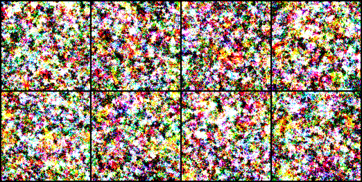

# Stable-Diffusion-Flowers

This repository contains an implementation of the Stable Diffusion model for image generation.
It is trained on the Flowers102 dataset. Everything is implemented from scratch using PyTorch.

---

## Results


Here are some samples generated by the model after training for 500 epochs.
It can be seen that the model is able to generate realistic looking flowers (and some that look like organic waste).

---

## Installation

To get started with this project, follow these steps:

1. **Clone this repository**:

   ```bash
   git clone https://github.com/ProfessorNova/Stable-Diffusion-Flowers.git
   cd Stable-Diffusion-Flowers
   ```

2. **Set up Python Environment**:
   Make sure you have Python installed (tested with Python 3.10.11).

3. **Install PyTorch**:
   Visit the [PyTorch website](https://pytorch.org/get-started/locally/) for proper PyTorch installation based on your system configuration.

4. **Install Additional Dependencies**:
   There are two additional dependencies required for this project. `tqdm` is used for progress bars and `matplotlib` is used for plotting the results during inference.

   ```bash
   pip install tqdm matplotlib
   ```

5. **Run the Pretrained Model**:
   To generate images using the pretrained model, run the following command:

   ```bash
   python sd_inference.py
   ```

   This will generate 8 images and plot them using matplotlib.

---

## Training

To train the model from scratch, run the following command:

```bash
python sd_train.py
```

This will start the training process. The model will generate samples after every epoch and save them in the `output_sd` folder by default.

Here are some images generated during training:

- **Epoch 1**:

  

  It is just pure noise at this point.

- **Epoch 10**:

  

  The model is starting to generate some larger blobs.

- **Epoch 50**:

  

  You can see some flower-like structures starting to form.

- **Epoch 100**:

  

  Colors are getting more vibrant and the shapes are more defined.

- **Epoch 300**:

  

  Now you can really spot the flowers. But some still look very weird.

- **Epoch 500**:

  

  Now almost all images look like flowers. Some are very realistic, some are not.

---

## Acknowledgements

This project was highly inspired by the keras example [Denoising Diffusion Implicit Models](https://keras.io/examples/generative/ddim/) by András Béres.
